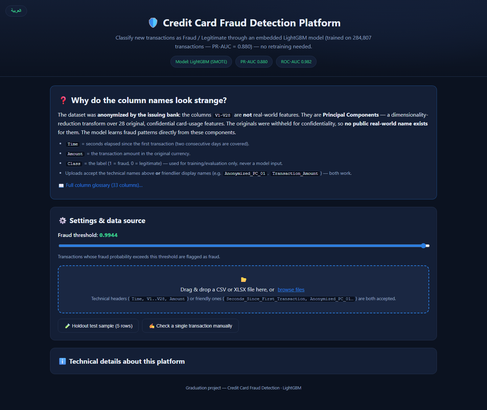
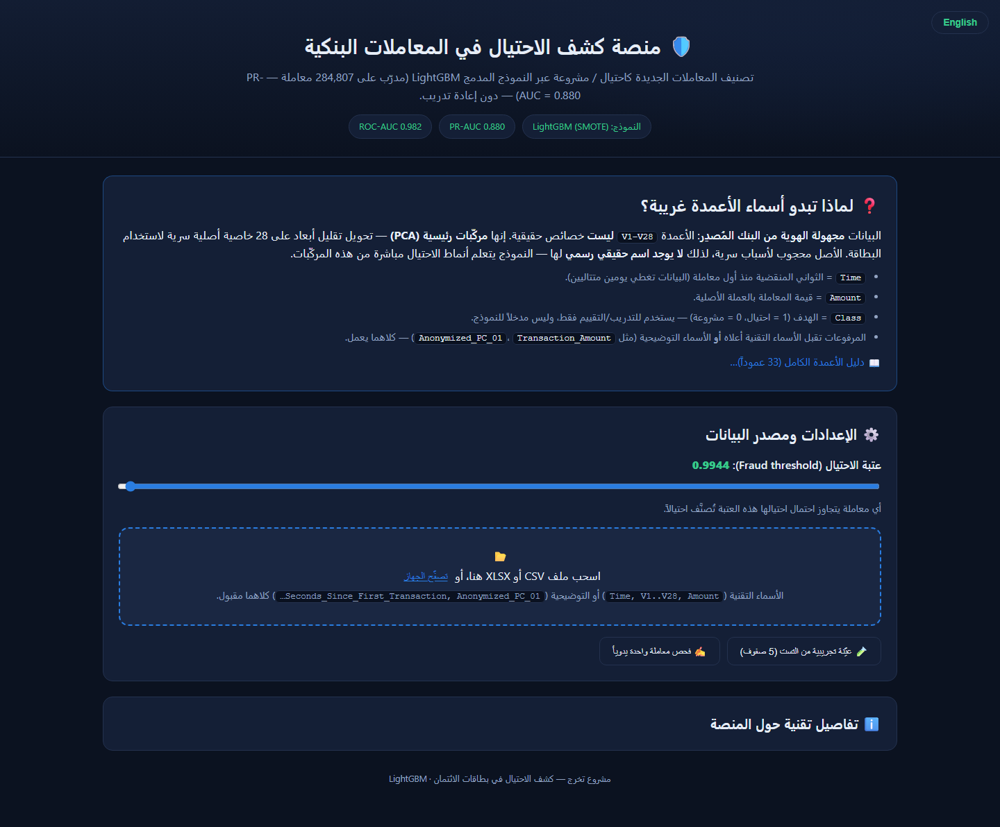
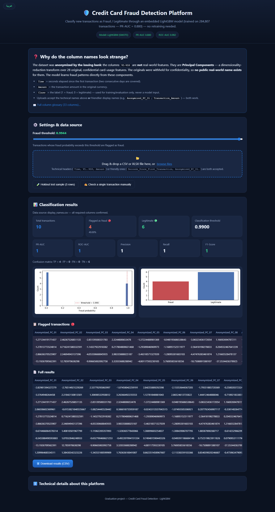
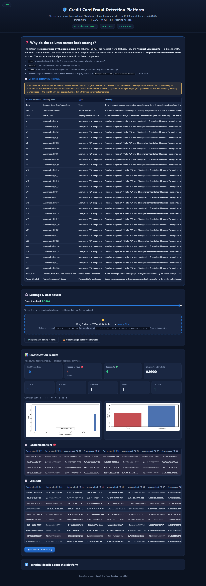

<h1 align="center">🛡️ Credit Card Fraud Detection</h1>

<p align="center">
  End-to-end machine-learning project that detects fraudulent credit-card transactions, with a <b>bilingual (EN / AR) web application</b> that ships the trained model for classifying <i>new</i> data — no retraining needed.
</p>

<p align="center">
  
  
  
  
  
</p>

---

## 📸 Screenshots

| Home (English) | Home (Arabic) |
|---|---|
|  |  |

| Live classification results | Column glossary |
|---|---|
|  |  |

---

## 🎯 Project overview

- **Dataset:** 284,807 European card transactions (2 days), only **492 frauds** (~0.17 %) — highly **imbalanced**.
- **Target:** binary classification `Class` (1 = fraud, 0 = legitimate).
- **Pipeline:** EDA → preprocessing (RobustScaler on `[Amount, Time]`) → 8 model variants
  (Logistic Regression / Random Forest / XGBoost / LightGBM × *weighted* / *SMOTE*) →
  threshold tuning → SHAP interpretation.
- **Best model:** `LightGBM (SMOTE)` — **PR-AUC 0.880**, ROC-AUC 0.982, F1-optimal threshold **0.9944**.

## 🧠 Why are the columns named `V1..V28`?

The dataset was anonymized by the issuing bank: `V1–V28` are **Principal Components**
(dimensionality reduction) of 28 original, confidential card-usage features. The originals
are withheld for confidentiality, so **no public real-world name exists** for them. This
project therefore uses honest display names (`Anonymized_PC_01`…) and explains this in the
web app's "Why do the column names look strange?" section, backed by a full bilingual glossary.

## 🌐 Web application (Flask)

A standard web app (no front-end framework) that embeds the champion model + fitted scaler:

- **Live demo:** https://credit-card-fraud-detection-netro3.vercel.app
- Repository: https://github.com/AbdelGad0/credit-card-fraud-detection

- Upload **CSV / XLSX** (drag & drop) → batch classification, summary cards, probability
  distribution chart, flagged transactions, full results, downloadable CSV.
- Automatic **verification metrics** (PR-AUC / ROC-AUC / Precision / Recall / F1 /
  Confusion Matrix) when the file contains a `Class` column.
- Adjustable **fraud threshold** slider (default = 0.9944).
- Manual **single-transaction** check and a **holdout test sample** button.
- **Bilingual EN/AR** toggle (English is the default; stored in `localStorage`), RTL/LTR aware.
- Technical **or** friendly column names (`Time` / `Seconds_Since_First_Transaction`,
  `V14` / `Anonymized_PC_14`, …) are both accepted on upload.

### Run locally

```bash
C:\Users\abdel\anaconda3\python.exe webapp/app.py --port 8000
# open http://localhost:8000
```

> Uses the same environment that trained the model (`anaconda3`).

### Deployed on Vercel

The Flask app runs as a Python serverless function (`api/index.py` via `vercel.json`).
Notes for deployment:

- `.vercelignore` excludes heavy training artifacts (`creditcard.csv`, `X_train*`,
  non-champion models…) — only `LightGBM_smote.pkl`, `scaler.pkl`, `X_test/y_test.pkl`
  and `best_model.json` ship with the function.
- Serverless filesystems are read-only: `config.py` tolerates `mkdir` failures, and
  `deployment/predictor.py` preloads a vendored `libgomp.so.1` (Vercel's runtime lacks
  OpenMP) before LightGBM loads.
- Redeploy with: `vercel --prod --yes` (from the repo root).

## 🗂️ Project structure

```
├── 01_eda.py … 06_interpretation.py   # analysis & modelling pipeline
├── config.py                          # shared paths / constants
├── deployment/
│   ├── predictor.py                   # inference pipeline (single entry point)
│   └── schema.py                      # friendly names + bilingual glossary
├── webapp/                            # Flask web app (JSON API + static frontend)
├── api/index.py                       # Vercel serverless entry point
├── vendor/libgomp.so.1               # OpenMP shim for serverless runtimes
└── outputs/                           # model weights, scaler, metrics, figures
```

## 📦 Stack

Python (pandas, numpy, scikit-learn, LightGBM, XGBoost, SHAP, matplotlib, joblib, Flask).

---

<p align="center"><i>Graduation project — Credit-Card Fraud Detection · LightGBM</i></p>